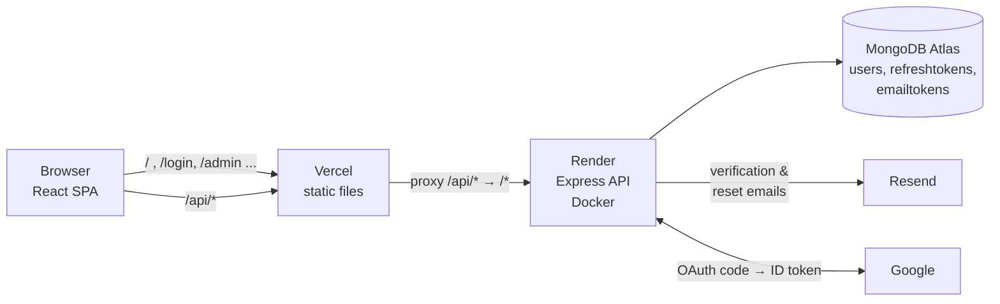
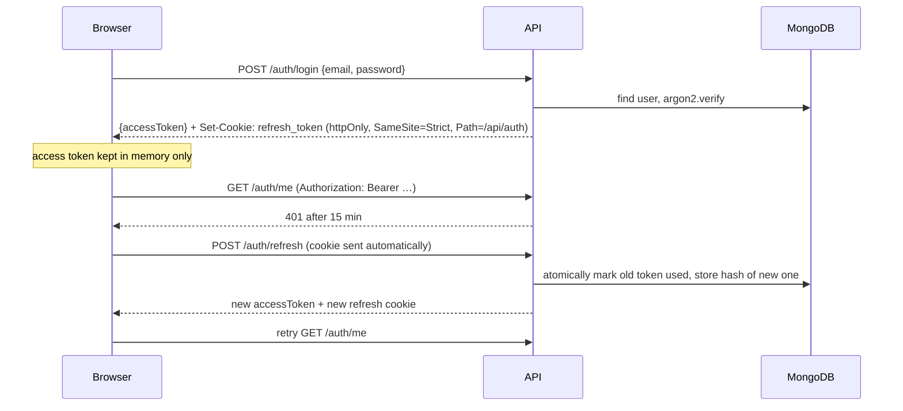

# Auth Service

[](https://github.com/Princekathiriya/auth-service/actions/workflows/ci.yml)

A production-style authentication service: email/password and Google login, refresh-token
rotation with theft detection, email verification, password reset, roles, and rate limiting.
Express + TypeScript + MongoDB API, with a small React client to show the flows end to end.

**Live demo:** [https://REPLACE-ME.vercel.app](https://prins-auth-service.vercel.app/)
_(The API runs on Render's free tier and sleeps when idle, so the first request can take ~50 seconds.)_

---

## Features

| Area | What's implemented |
|---|---|
| Accounts | Register, login, logout, logout everywhere, `GET /auth/me` |
| Passwords | argon2id hashing, 8–128 chars, Unicode NFKC normalisation |
| Sessions | 15-min JWT access token (memory only) + 7-day refresh token (httpOnly cookie), rotated on every use |
| Theft detection | Reusing an old refresh token revokes that whole session; 10 s grace window for multi-tab races |
| Email | Verification (24 h links) and password reset (30 min, single use, logs out all devices) |
| Google | OAuth 2.0 authorization code flow with PKCE, `state` and `nonce`; links to existing accounts safely |
| Roles | `user` / `admin`, admin API to list, search, promote/demote and delete users |
| Abuse protection | Per-IP and per-email rate limits on login, signup and reset; email-bombing protection |
| Ops | Docker Compose, GitHub Actions CI, structured JSON logs with secrets redacted, health checks |

## Architecture



The browser only ever talks to **one origin** (the Vercel app). Vercel serves the React build and
forwards `/api/*` to the API on Render. That keeps the refresh cookie **first-party**, so
`SameSite=Strict` works in every browser, including Safari and Firefox, which block third-party
cookies. Hosting the frontend and API on two free domains (`*.vercel.app`, `*.onrender.com`)
would make it a third-party cookie, and login would not survive a reload there.

### Token flow



## Key design decisions

**Why two tokens?** A JWT access token can be verified without a database lookup, which is fast, but
it can't be revoked before it expires. A refresh token is stored in the database, so it *can* be
revoked, and that is what makes logout work. Keeping the access token short (15 min) limits
how long a leaked one is useful.
*Trade-off:* after logout-all or a password reset, existing access tokens stay valid for up to
15 minutes. Admin routes avoid this by checking the role in the database instead of trusting
the JWT.

**Why is the access token in memory, not localStorage?** Any XSS bug can read localStorage. On a page reload
the client calls `/auth/refresh`, which uses the httpOnly cookie that JavaScript can't read.

**Refresh rotation and reuse detection.** Every refresh token works once. Tokens from one login
form a *family*. If an already-used token is presented again, someone copied it, so the whole
family is revoked. Marking a token as used is a single atomic `findOneAndUpdate`, so two
simultaneous refreshes can't both succeed. The client shares one in-flight refresh
between all requests in a tab, and uses the Web Locks API across tabs, so normal use never
triggers a false theft alarm.

**Only hashes are stored.** Passwords use argon2id (slow on purpose). Refresh and email tokens are
256-bit random values stored as SHA-256 hashes: there's nothing to brute-force, so a fast hash
is enough, and a database leak exposes no usable tokens.

**Login doesn't reveal which emails have accounts.** Login returns the same 401 for "no such email" and "wrong
password", and runs argon2 against a dummy hash for unknown emails so the response time matches.
Forgot-password always responds `202` immediately and does the work in the background.
*Trade-off:* registration returns `409 EMAIL_TAKEN`, which most products accept for usability.
Rate limiting makes it slow to abuse.

**Google OAuth without Passport.** About 100 lines implementing the authorization code flow directly:
`state` (login CSRF), PKCE (a stolen code is useless), `nonce` (ID token replay), and full
ID-token verification (signature via Google's JWKS, issuer, audience). Users are matched by
Google's stable `sub`, not email. **Pre-account hijacking** is handled: if Google login links to
an account whose email was never verified, that account's password and sessions are removed,
because an attacker may have registered the victim's address first.

**Race conditions handled in the database, not in application code.** A unique index prevents duplicate signups.
Conditional updates prevent lost role changes. Removing the last admin is prevented even when
two admins demote each other at the same moment: the demotion is re-checked and undone. A
multi-document transaction would also work, but needs a replica set.

**Rate limiting.** Login counts only *failed* attempts, per IP (credential stuffing) and per email
(botnets guessing one account). Forgot-password is limited per target email to stop
email bombing. Limits key on `req.ip`, so `trust proxy` is set to the exact number of proxies
(`TRUST_PROXY_HOPS`). Trusting more would let clients fake their IP via `X-Forwarded-For`.

## Security checklist

| Threat | Mitigation |
|---|---|
| Password cracking after a DB leak | argon2id; tokens stored as hashes |
| XSS stealing sessions | Refresh token httpOnly; access token in memory; strict CSP on the client |
| CSRF | `SameSite=Strict` cookie scoped to `/api/auth`; `Origin` check on cookie endpoints |
| Session theft | Refresh rotation + reuse detection; logout-all; reset revokes all sessions |
| User enumeration | Identical login/forgot responses and timing; per-email rate limits apply to unknown emails too |
| Brute force / credential stuffing | Per-IP and per-email failed-login limits |
| NoSQL injection / mass assignment | zod validates and strips every input; `strictQuery` in Mongoose |
| ReDoS in admin search | User input escaped before use in `$regex`, anchored prefix search |
| JWT attacks | Algorithm pinned (HS256), issuer/audience checked, short expiry, minimal claims |
| OAuth attacks | state, PKCE S256, nonce, ID token verification, pre-account-hijacking defence |
| Open redirect | Post-login redirect accepts internal paths only |
| Secrets in logs | Authorization/Cookie/Set-Cookie redacted; OAuth `code`/`state` stripped from URLs |
| HTML injection in emails | User-supplied names escaped in email templates |

## Tech stack

**API:** Node 26, Express 5, TypeScript (strict), MongoDB + Mongoose, zod, jose (JWT), argon2,
express-rate-limit, pino
**Client:** React 19, Vite, React Router, TypeScript (strict)
**Testing:** Vitest, Supertest, mongodb-memory-server, Testing Library
**Ops:** Docker (multi-stage, non-root), Docker Compose, nginx, GitHub Actions, Render, Vercel, MongoDB Atlas, Resend

## Running locally

### Option 1: Docker (everything, one command)

```bash
docker compose up --build
```
Open http://localhost:8080. MongoDB runs in a container with a persistent volume.

| Task | Command |
|---|---|
| See verification/reset links (emails are logged locally) | `docker compose logs api \| grep -E "verify-email\|reset-password"` |
| Make a user admin | `docker compose exec api node dist/scripts/makeAdmin.js you@example.com` |
| Stop / stop and wipe data | `docker compose down` / `docker compose down -v` |

### Option 2: Node, no database install

```bash
cd server && npm install && cp .env.example .env   # set JWT_ACCESS_SECRET: openssl rand -base64 48
npm run dev:memory                                  # API on :4000 with an in-memory MongoDB
cd client && npm install && npm run dev             # http://localhost:5173
```

### Option 3: Node + your own MongoDB (e.g. Atlas)

Set `MONGODB_URI` in `server/.env`, then `npm run dev`. Promote a user with
`npm run make-admin -- you@example.com`.

### Tests

```bash
cd server && npm test     # 129 tests: API, security, race conditions (real MongoDB in memory)
cd client && npm test     # 41 tests: token refresh logic, pages, accessibility
```
CI runs typecheck, lint, tests and build for both apps, a dependency audit, and a Docker build
on every push.

## API reference

| Method | Path | Auth | Description |
|---|---|---|---|
| POST | `/auth/register` | – | Create account, send verification email |
| POST | `/auth/login` | – | Returns access token, sets refresh cookie |
| POST | `/auth/refresh` | cookie | Rotate refresh token, new access token |
| POST | `/auth/logout` | cookie | End this session |
| POST | `/auth/logout-all` | bearer | End every session |
| GET | `/auth/me` | bearer | Current user |
| POST | `/auth/verify-email` | – | `{ token }` |
| POST | `/auth/resend-verification` | bearer | New verification link |
| POST | `/auth/forgot-password` | – | `{ email }`, always `202` |
| POST | `/auth/reset-password` | – | `{ token, password }`, revokes all sessions |
| GET | `/auth/google` → `/auth/google/callback` | – | Google OAuth |
| GET | `/admin/users?page&limit&search&role` | admin | Paginated user list |
| GET | `/admin/users/:id` | admin | One user |
| PATCH | `/admin/users/:id/role` | admin | `{ role }` |
| DELETE | `/admin/users/:id` | admin | Delete user and their sessions |

Errors always have the shape `{ "error": { "code": "INVALID_CREDENTIALS", "message": "...", "details"?: {...} } }`.
Clients branch on `code`, never on `message`.

## Deployment

| Piece | Where | Config |
|---|---|---|
| API | Render (free web service, Docker) | [`render.yaml`](render.yaml) |
| Client | Vercel (static) + `/api` proxy | [`client/vercel.json`](client/vercel.json), `VITE_API_URL=/api` |
| Database | MongoDB Atlas (M0 free) | `MONGODB_URI` secret on Render |
| Email | Resend | `RESEND_API_KEY` secret on Render |

All configuration is validated at startup by a zod schema ([`server/src/config/env.ts`](server/src/config/env.ts)),
so a missing or malformed variable stops the process with a clear message instead of failing later.

## Known limitations

1. **Access tokens outlive logout by up to 15 minutes** (see "Why two tokens?"). A blocklist would fix it, at the cost of a lookup per request.
2. **Rate-limit counters are in memory.** They reset on restart, and multiple instances would each have their own counters. A shared Redis store would fix this.
3. **Emails are sent fire-and-forget.** A failed send is logged, not retried. A job queue (e.g. BullMQ) would add retries.
4. **No breached-password check.** The HaveIBeenPwned k-anonymity API would block known-leaked passwords.
5. **JWT secret rotation logs everyone out.** Supporting key IDs (`kid`) with two active keys would allow seamless rotation.
6. **Demo email sender.** Without a verified domain, Resend only delivers to the account owner's address, so other demo users won't receive verification emails. They can still log in.
7. **Free-tier cold starts** on Render (~50 s after idling).

## How I used AI

> _Draft. Rewrite this in your own words so it describes what **you** did and checked._

I built this with Claude Code as a pair programmer, one milestone at a time (skeleton → login →
refresh tokens → email → OAuth → roles → rate limiting → client → CI → Docker → deploy). The AI
wrote most first drafts. My job was to specify each milestone, review the code, and make sure it
was actually correct before moving on.

What review and testing caught in the AI's drafts:
- **Errors in the error handler:** body-parser errors (malformed JSON, oversized bodies) were turned into 500s. Caught by a test.
- **A secret leaking into logs:** OAuth `code`/`state` were redacted from the logged URL but still logged in pino's separate `query` field. Found by checking real log output, not just the unit test.
- **Missing security headers:** an nginx `add_header` inheritance gotcha silently dropped the CSP from every page. Found by checking response headers of the running container.
- **Rate-limit bypass in Docker:** `trust proxy` was hard-coded for one proxy, so a fake `X-Forwarded-For` would have been trusted when no proxy exists.
- **React StrictMode vs single-use tokens:** the verify-email page would have sent two requests and shown "invalid link" for a valid one.
- **A stale-response race in admin search**, found because I made lint warnings fail CI.
- **Fragile code:** error handling that matched on message text instead of error codes; a deprecated Mongoose option.

How I verified things rather than trusting them:
- Tests for the attacks, not just the happy path: tampered and expired JWTs, token reuse, concurrent signups, two admins demoting each other, NoSQL injection payloads, header spoofing.
- **Mutation checks**: for important protections I removed the protective line and confirmed the matching test fails. A test that still passes without the fix proves nothing.
- Ran every layer for real: the built client against the real API, the Docker stack, and a local simulation of the Vercel proxy, before deploying.

## Project structure

```
auth-service/
├── server/                 Express API
│   ├── src/
│   │   ├── config/         env validation, DB connection
│   │   ├── middleware/     auth, roles, rate limits, errors, origin check
│   │   ├── models/         User, RefreshToken, EmailToken
│   │   ├── modules/
│   │   │   ├── auth/       login, sessions, email flows, Google OAuth
│   │   │   ├── admin/      user management
│   │   │   └── email/      mailer interface + templates
│   │   └── scripts/        make-admin, dev:memory
│   └── tests/
├── client/                 React SPA (Vite)
│   ├── src/lib/api.ts      fetch wrapper, in-memory token, single-flight refresh
│   ├── nginx/              config for the Docker image
│   └── vercel.json         rewrites /api/* to the API, security headers
├── docker-compose.yml
├── render.yaml
└── .github/workflows/ci.yml
```
